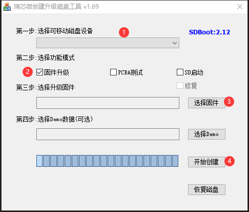

# SD 卡升级固件

1. 选择SD卡
2. 选择固件升级前的复选框
3. 选择需要升级的固件
4. 开始创建

## 如果是已经做过一次，需要更换固件和demo文件时

1. 拷贝固件到SD卡根目录，并重命名为sdupdate.img
2. 拷贝demo文件到SD卡根目录下的Demo目录中

SD引导升级卡格式(非GPT，目前不支持GPT，所以U-Boot需要配置CONFIG_RKPARM_PARTITION)