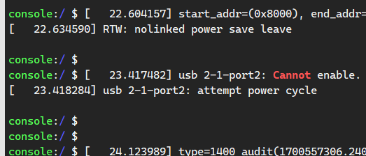
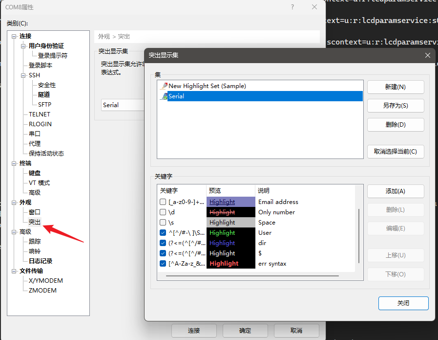
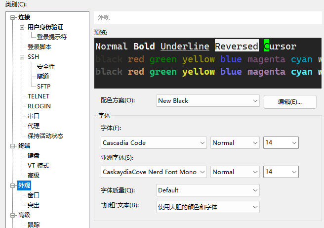

# xshell调试串口字符高亮配置
## 示例



```regex
# prompt 颜色
^[^/#-\ ]\S\s?\S+(?=((:|])\S*\s?\S*(\$|#)\s{1}))

# 路径颜色
(?<=(^[^/#-\ ]\S{0,8}\s?\S{0,8}:))\S*\s?\S*(?=(\$|#)\s{1})

# $ or # white color
(?<=(^[^/#-\ ]\S\s?\S+:\S*\s?\S*))(\$|#)\s{1}
```



## 字体设置

## 失败信息高亮
~~~regex
[^A-Za-z_&-](\[\-w[A-Za-z-]+\]|caught signal [0-9]+|cannot|(connection (to (remote host|[a-z0-9.]+) )?)?(closed|terminated|stopped|not responding)|exited|no more [A-Za-z] available|unexpected|(command |binary |file )?not found|ooo?o?o?ps|out of (space|memory)|low (memory|disk)|unknown|disabled|disconnected|deprecated|refused|disconnect(ion)?|advertencia|avvertimento|attention|warnings?|achtung|exclamation|alerts?|warnungs?|advarsel|pedwarn|aviso|varoitus|upozorenje|peringatan|uyari|varning|avertissement|\(ww\)|\(\?\?\)|could not|unable to)[^A-Za-z_-]
~~~